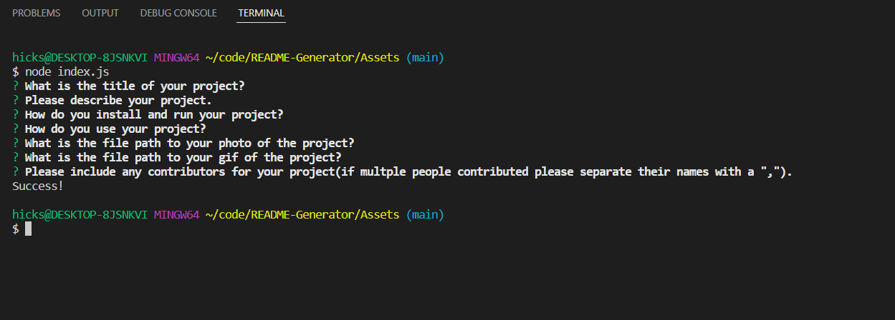
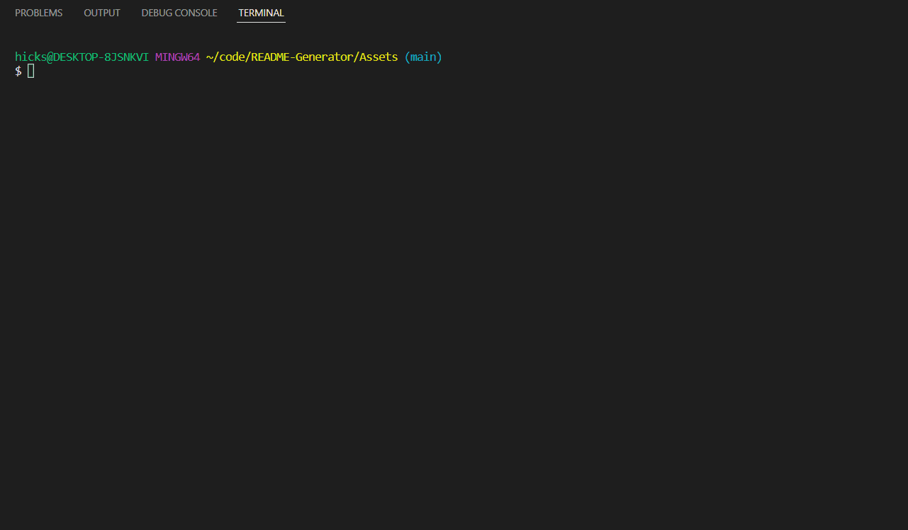

# README GENERATOR 

## Project description
The ReadME Generator application is 

## Installation Instructions
This package uses Node and you will need to install Node in order to use this application. Please visit the [NodeJS](https://nodejs.dev/learn/how-to-install-nodejs) website for further instruction on how to install and use NODE on your specific device. 

Once Node is installed you are good to run the program. 
        
## How To Use
To start you will need to navigate to the ReadMe Generator in your terminal using the change directory command (cd). Once you are at the directory you will need to apply the Node package ("npm i" command). Once Node is installed you can run "node index.js" to start up the program. You will then follow the prompts given in the terminal. After the prompts are filled out your ReadMe will be completed. 

This is a photo of the prompts in the terminal:

See Gif example:

        
## Contributing 
Application uses Node and all coding was done by Jeff Hicks. 
